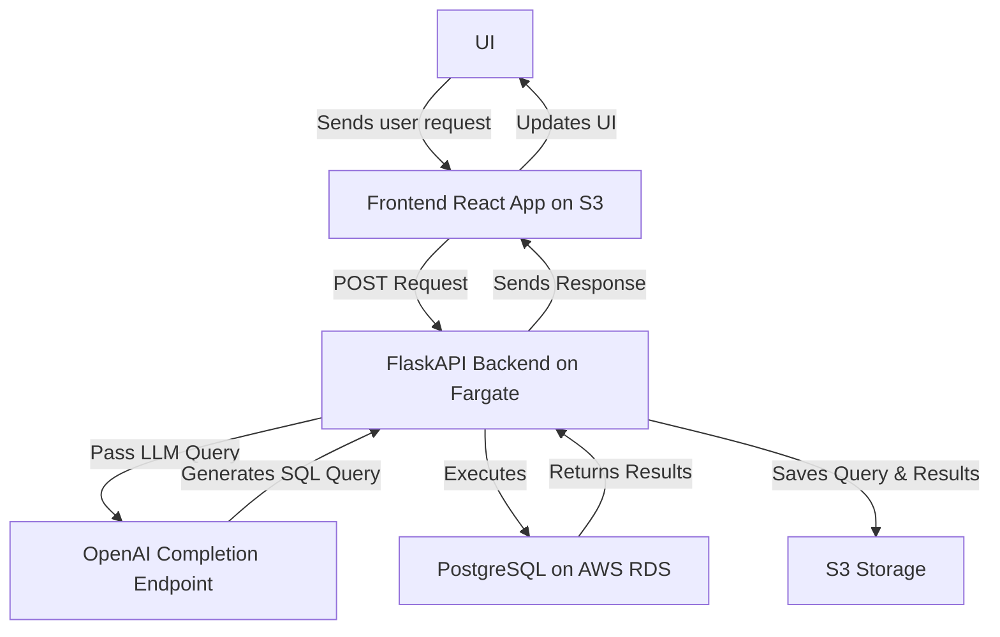

```mermaid
graph TD;
  
  A[UI] -->|Sends user request| B[Frontend React App on S3]
  B -->|POST Request| C[FlaskAPI Backend on Fargate]
  C --> | Pass LLM Query | D[OpenAI Completion Endpoint]
  D -->|Generates SQL Query| C

  C --> |Executes| F[PostgreSQL on AWS RDS]
  F -->|Returns Results| C
  
  %% Data Logging & Storage
  C -->|Saves Query & Results| H[S3 Storage]
  C -->|Sends Response| B

  %% UI Display
  B -->|Updates UI| A


```
